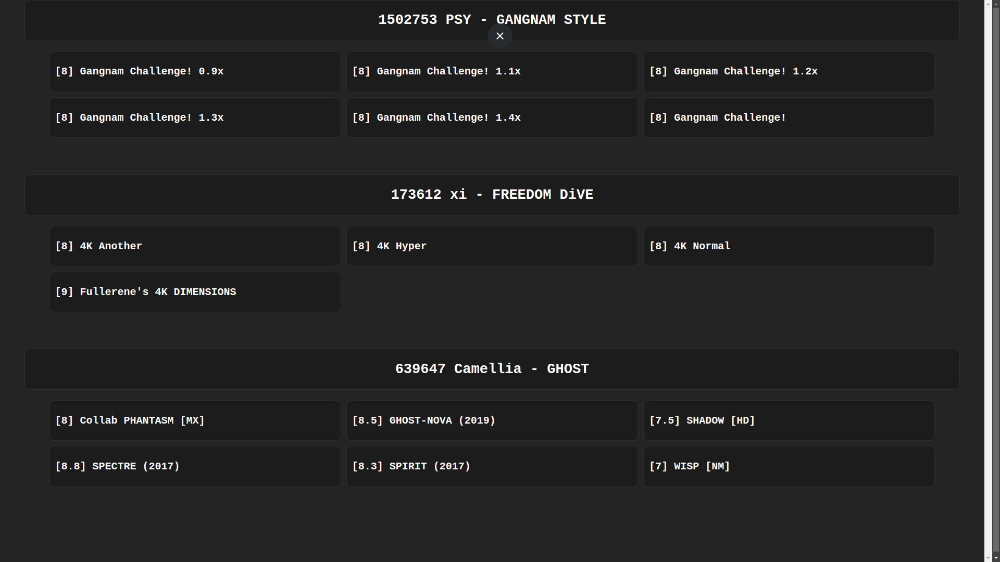
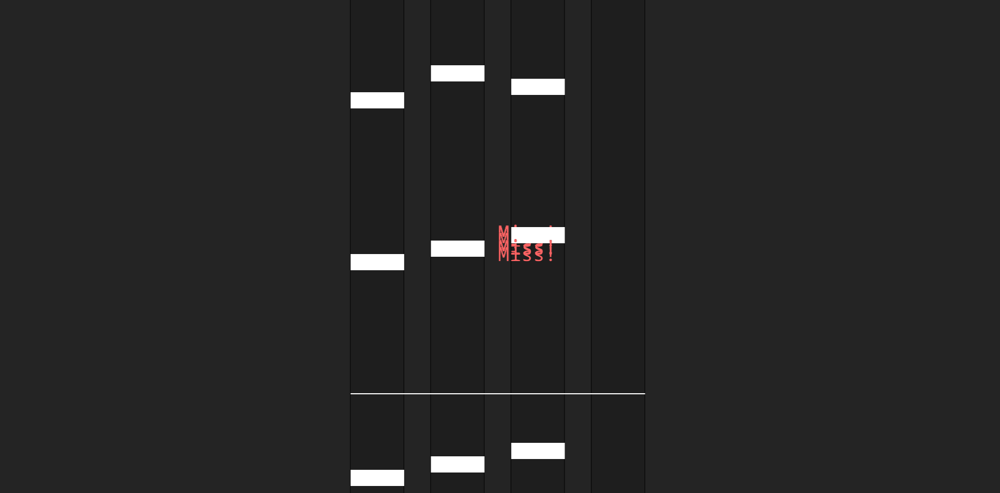

  

## Contents

1. [Current branch preview](#current-branch-preview)
   1. [Video(s)](#videos)
   2. [Picture(s)](#pictures)
2. [FAQ](#faq)
   1. [Where are the games?](#where-are-the-games)

## Current branch preview

> I remade osu mania with kaboom.js
>   You can load songs from the original game into this game and it'll work the same.

Inspired by: https://osu.ppy.sh/

## Video(s)

#### ver 1.1 alpha

#### ver 0.1

### Picture(s)

#### ver 1.1 alpha

## FAQ

### Where are the games?

Every branch is a different game.
  If you check the readme of the branch, you'll see what the game is.
