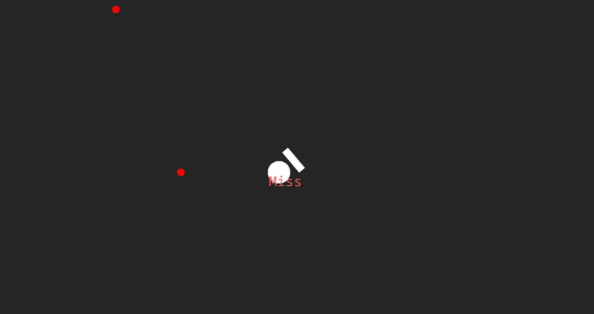

## Contents
1. [Current branch preview](#current-branch-preview)
    1. [Video(s)](#videos)
    2. [Picture(s)](#pictures)
2. [FAQ](#faq)
    1. [Where are the games?](#where-are-the-games)

## Current branch preview
> This game is inspired by a that currently is in demo called BeatBlock.
  I've added the basics like the block approaching the player and making the hit count.
  Though hold blocks and everything else are not added.

### Video(s)

### Picture(s)

## FAQ

### Where are the games?
Every branch is a different game.
  If you check the readme of the branch, you'll see what the game is.
