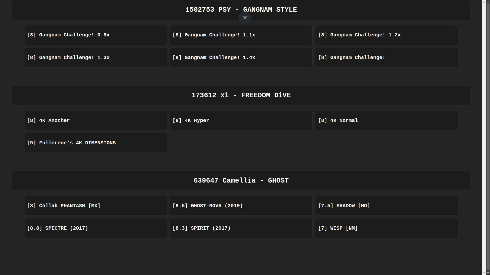
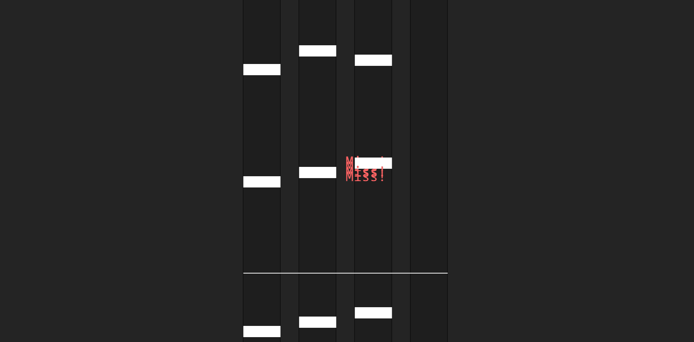

<p align="center">
  
</p>

## Contents

1. [Current branch preview](#current-branch-preview)
   1. [Video(s)](#videos)
   2. [Picture(s)](#pictures)
2. [About](#about)
3. [Introduction](#introduction)
3. [FAQ](#faq)
   1. [Where are the games?](#where-are-the-games)


## Introduction

> I remade osu mania with kaboom.js
> <br> You can load songs from the original game into this game and it'll work the same.

Inspired by: https://osu.ppy.sh/

## Installation
> How to install with filezilla
1. Install file
```bash
git clone https://github.com/jvpm1/jsgame.git
```

2. Put the ``src`` folder in your server's public_html

3. Now you're ready to play!

## Video(s)

#### ver 1.1 alpha


#### ver 0.1


### Picture(s)

#### ver 1.1 alpha




## FAQ

### Where are the games?

Every branch is a different game.
<br> If you check the readme of the branch, you'll see what the game is.

Play test met Thomas 17 Januari

## Vragenlijst

- **Beweging:**
  - Top: Wat vond je het meest vloeiend aan de beweging van het personage?
    de keynbinds hoe die registreren
  - Tip: Was er iets aan de beweging dat je als haperend of onnatuurlijk ervaarde?
    niks aan de hand
- **Besturing:**
  - Top: Welke besturingsmethode vond je het meest intuïtief?
    hoe de blokjes op de muziek naar beneden komen
  - Tip: Waren er momenten waarop je moeite had om het personage precies te doen wat je wilde?
    ja het ging een beetje te snel ook op de normale moeilijkheids graad
- **Beloning:**
  - Top: Welke beloningen vond je het meest motiverend om door te gaan?
    of je een bad oke of perfect kon krijgen als het goed timeden
  - Tip: Waren er beloningen die je niet zo interessant vond of die je het gevoel gaven dat ze weinig toevoegden?
    er zijn naast dat geen beloningen
- **Progressie:**
  - Top: Voelde je dat je voldoende uitdaging had om gemotiveerd te blijven?
    ja er zijn al best veel nummers om te spelen, waardoor je niet na 3 keer spelen alles al hebt gedaan
  - Tip: Waren er momenten waarop je het gevoel had dat de progressie te snel of te langzaam ging?
    nee
- **Algemeen:**
  - Top: Wat vond je het leukste aspect van de game?
    de verschillende nummers waar uit je kan kiezen
  - Tip: Als je één ding zou kunnen veranderen aan de game, wat zou dat dan zijn?
    mischien leuk om een score board toe te voegen en mischien leuk als je tegen een bot kan spelen .
